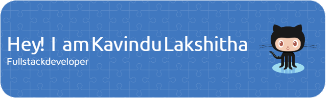

 

 # **_About Me_** 🎈

- 👋 Hi, I’m @KavinduLakshitha. I'm an undergraduate with a BSc. Software Engineering, freelancer and web developer
- 👀 I’m interested in programming and innovation.
- 🌱 I’m currently learning Java and PHP
- 📫 How to reach me kavindulakshitha406@gmail.com

  

  # **_My Plannings_** ⭐

  - [x] Learn HTML , CSS, JavaScript;
  - [x] Learn Java language and develop a swing application
  - [ ] Learn Java EE and Spring Boot
  - [ ] Deveop a Java Web application
  - [ ] Learn React
  - [x] Learn React Native
  - [ ] Develop a Mobile Application (React Native)📱
  - [x] Learn PHP
  - [ ] Learn Laraval
  - [x] Learn Arduino and Develop a Robot
  - [ ] etc. 

  

    <h2>My Skills ⚙💻</h2>
    

      

  

  

  
  

  

  

  

    

<!---
KavinduLakshitha1/KavinduLakshitha1 is a ✨ special ✨ repository because its `README.md` (this file) appears on your GitHub profile.
- 💞️ I’m looking to collaborate on ...
You can click the Preview link to take a look at your changes.
--->
